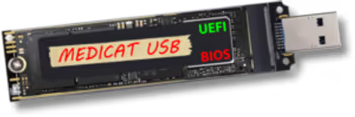
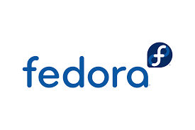

<p align="center">

  <!-- Project Logos -->
  
  
  

  <!-- Spacer -->
  <br><br>

  <!-- Version -->
  

  <!-- License -->
  

  <!-- Fedora -->
  

  <!-- Ventoy -->
  

  <!-- Shell -->
  

  <!-- GitHub Stars -->
  

  <!-- GitHub Issues -->
  

  <!-- Last Commit -->
  

</p>

# MediCat USB Builder for Fedora  
### MediCat USB Builder for Fedora is a fully automated, Fedora‑compatible tool for creating a Ventoy‑based MediCat USB drive.  
### It includes a complete Ventoy patch layer for Fedora 40–44, unified logging, update‑only mode, smart SSD caching, progress bars, and full BIOS/UEFI boot support.
### This project exists because the official MediCat installer does not work on Fedora due to the removal of the `mkexfatfs` binary.  
### The included Fedora Patch Layer restores full Ventoy compatibility without modifying Ventoy itself. 

**Version 4.1 — Professional Clean Build**

---

## 📌 Overview

**MediCat USB Builder for Fedora** is a fully automated tool that creates a **Ventoy‑based MediCat USB** on Fedora Linux (and derivatives).  
It supports:

- Full installation (Ventoy + format + full copy)  
- Skip‑Ventoy mode  
- Update‑only mode (copy only new/modified files)  
- Smart SSD cache for MediCat  
- Progress bars (7z extraction + rsync)  
- Automatic cleanup (unmount on exit)  
- Fedora‑patched Ventoy installer  

This project was created because the official *Medicat_Installer.sh* does not work reliably on **Fedora 44+**, despite notes on GitHub suggesting Fedora compatibility.

---

## 🧩 Why this project exists

As a Fedora 44 user, I discovered that the official MediCat installer:

👉 https://github.com/mon5termatt/medicat_installer  

…although updated with Fedora notes, **did not work on Fedora 40–44**.

## 🧠 Summary of the Fedora issue

- Ventoy requires `mkexfatfs`
- Fedora removed it
- Ventoy fails its internal checks
- The official MediCat installer cannot proceed
- The Fedora Patch Layer restores compatibility
- Ventoy installs correctly again
- MediCat USB creation works flawlessly on Fedora 40–44
- 
### ❌ Fedora removed the `mkexfatfs` binary required by Ventoy  
Ventoy depends on `mkexfatfs` for formatting and validation.  
Fedora 40–44 removed this binary and replaced it with:

```
mkfs.exfat
```

This caused Ventoy to fail with:

```
mkexfatfs: command not found
Some tools can not run on current system.
```

Because of this, Ventoy’s internal checks failed, and the installer aborted.

This project solves that.

---

## 🧠 How I solved it (reasoning & process)

To fix this, the project includes a **🛠 Fedora Patch Layer for Ventoy**:

- `Ventoy2Disk_fedora.sh`
- `VentoyWorker_fedora.sh`

These wrappers:

### ✔ Create a safe symlink  
```
mkexfatfs → mkfs.exfat
```

### ✔ Fix Ventoy tool detection  
Ventoy now believes the required tools exist and proceeds normally.

### ✔ Fix partition wait timing  
Fedora’s udev timing differs from Debian/Ubuntu, causing Ventoy to wait incorrectly.

### ✔ Run the official Ventoy scripts in a Fedora‑compatible environment  
The wrappers do **not** modify Ventoy itself — they simply adapt the environment.

### ✔ Work with all future Ventoy versions  
Because the symlink and wrapper logic are version‑agnostic.

---

### 4. Creating a unified logging system  
With consistent color‑coded output:

- **[INFO]** → yellow  
- **[OK]** → green  
- **[WARN]/[ERROR]** → red  
- Default output → blue  

### 5. Implementing a smart cache system  
The MediCat archive (28GB) is stored in:

```
~/Medicat_USB_Cache
```

Extraction happens **only once**, dramatically speeding up future updates.

### 6. Adding update‑only mode  
Using:

```
rsync --update
```

Only new or modified files are copied.  
This reduces update time from **30 minutes → 30 seconds**.

### 7. Adding cleanup trap  
Automatic unmount on exit ensures no corrupted USB states.

---

## 🧑‍💻 Credits (updated)

### 🔹 Fedora Patch Layer  
Created to restore Ventoy compatibility on Fedora 40–44 by:

- Replacing missing `mkexfatfs` with a symlink to `mkfs.exfat`
- Fixing Ventoy worker timing
- Ensuring the official Ventoy scripts run without modification

### 🔹 Ventoy Project  
https://www.ventoy.net/  
https://github.com/ventoy/Ventoy  

### 🔹 MediCat USB  
https://medicatusb.com/

### 🔹 mon5termatt (MediCat Installer)  
https://github.com/mon5termatt/medicat_installer  
Provided the mirror selection logic and cdn.bat parsing.

### 🔹 lukumaki (Project Author)  
Identified the Fedora 44 incompatibility, implemented the patch layer,  
and built the first fully working **Fedora‑compatible MediCat USB Builder**.

---

## ⚙️ Installation & Usage

There are **two recommended ways** to run the MediCat USB Builder for Fedora:

---

# 🟦 Method 1 — Clone the Repository (recommended for developers)

This method is ideal if you want to:

- inspect or modify the code  
- contribute to the project  
- keep a local copy of the installer  

### Clone the repository:

```bash
git clone "https://github.com/lukumaki/medicat-fedora-usb-installer.git"
cd medicat-fedora-usb-installer
chmod +x medicat_usb_builder.sh
```

### Run the installer:

```bash
./medicat_usb_builder.sh
```

---

# 🟩 Method 2 — One‑Line Installer (recommended for most users)

This method downloads and runs the latest version of the installer **without cloning the repo**.

### Run directly from GitHub:

```bash
bash <(curl -fsSL https://raw.githubusercontent.com/lukumaki/medicat-fedora-usb-installer/main/medicat_usb_builder.sh)
```

### Important notes about this method:

- It **does** save files locally (Ventoy + MediCat USB).
- It creates and uses the following directories:

```
~/Medicat_USB_Cache/           # Stores MediCat archive (≈ 28 GB)
~/Medicat_USB_Cache/extracted/ # Extracted MediCat files (≈ 28 GB)
~/Medicat_USB_Cache/ventoy/    # Downloaded Ventoy release
```

- These files remain on your system for:
  - faster updates  
  - avoiding re‑downloads  
  - incremental rsync mode  

---

# 🟥 ⚠️ MediCat USB Size & Time Requirements

The MediCat USB archive is **~28 GB**.

Depending on your system:

### Download time  
- Fast fiber: 5–10 minutes  
- Average broadband: 20–40 minutes  
- Slow connections: 1+ hour  

### Extraction time  
- SSD: 3–6 minutes  
- HDD: 10–20 minutes  

### USB copy time  
- USB 3.0 stick: 10–25 minutes  
- USB 2.0 stick: 30–60 minutes  
- SSD enclosure: 3–8 minutes  

Because of this, the installer includes:

- **7z extraction progress bar** (`-bsp1`)
- **rsync global progress bar** (`--info=progress2`)

So the user always knows how far the process has progressed.

---

# 🟧 Available Flags

You can combine the installer with optional flags:

### Full installation (Ventoy + format + full copy)
```bash
./medicat_usb_builder.sh
```

### Skip Ventoy (keep existing Ventoy installation)
```bash
./medicat_usb_builder.sh --skip-ventoy
```

### Update‑only mode (copy only new/modified files)
```bash
./medicat_usb_builder.sh --update-only
```

### Force MBR partitioning
```bash
./medicat_usb_builder.sh --force-mbr
```

### Force GPT partitioning
```bash
./medicat_usb_builder.sh --force-gpt
```

---

# 🟪 Notes

- The installer supports both **BIOS** and **UEFI** boot modes.
- The Fedora Patch Layer ensures Ventoy works correctly on Fedora 40–44.
- The cache directory (`~/Medicat_USB_Cache`) can be safely deleted at any time.

---

## 📂 Directory Structure

The repository itself remains clean and lightweight:

```
medicat_usb_builder.sh
patch/
  Ventoy2Disk_fedora.sh
  VentoyWorker_fedora.sh
  README_fedora_patch.md
README.md
CHANGELOG.md
LICENSE
```

The installer automatically creates and uses the following directories in your HOME folder:

```
~/Medicat_USB_Cache/
│
├── Medicat.USB.vXX.XX.7z        # Downloaded MediCat archive (~28 GB)
├── extracted/                   # Extracted MediCat files (~28 GB)
└── ventoy/                      # Downloaded Ventoy release (20–30 MB)
```

These directories are used for:

- caching MediCat USB to avoid re‑downloads  
- storing extracted files for faster updates  
- storing the Ventoy release used during installation  

You may safely delete `~/Medicat_USB_Cache` at any time — the installer will recreate it automatically.


---

## 🛠 Dependencies (Fedora)

The script automatically installs:

- wget  
- curl  
- unzip  
- rsync  
- exfatprogs  
- ntfs‑3g  
- p7zip  
- p7zip‑plugins  
- bc  

---

## 🧪 Tested On

- Fedora 44 KDE  
- BIOS boot  
- UEFI boot  
- USB 3.0 sticks  
- SSD‑based USB enclosures  

---

## 🟢 Status

**Stable**  
Ready for daily use and incremental updates.

---

## 📜 License

MIT License.
